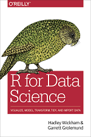
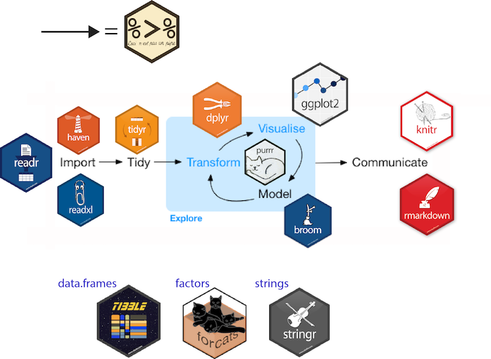
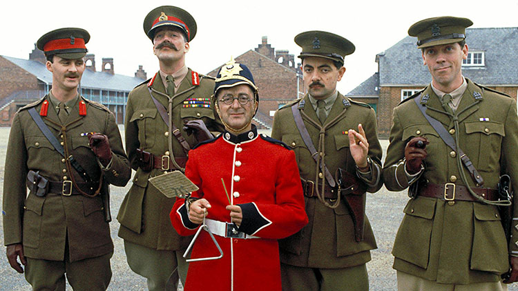

```{r setup, include = FALSE}
library(here)
library(tidyverse)
library(magick)
```

# This is not a geek-only seminar


# Why write code ?

## The Selfish Reason

<center>
<font size="10">  __Research == iterarive process__ </font>
</center>

<br>

```{r, echo = FALSE, fig.align = 'center'}
magick::image_read(here("images/sisyphus.png")) %>%
	magick::image_resize("150%x150%")
```


## The Pragmatic Reason

### Sometimes there is no other way...

<font size="8"> 

* Data is too big

* There is no GUI

</font> 

## The Holy Reason

<br>

<center>
<font size="9"> 
Research should be 

__reproducible__.
</font> 
</center>

## Research compendium

<font size="7"> 

* text
* data
* metadata
* __code__

</font> 

* _computation environment_ 


## Code == Blue Print 

<font size="7"> 

* From raw data to results
* Anyone can reproduce your analysis
* cf data management plan

</font>


# Why write good code ?

## Who is the code for ?

<font size="7"> 

Machine: code == blue print

People: <center>
code

==

Communication medium
</center>

</font> 

## How to write good code


```{r, eval = FALSE}
if(code == communication_medium){
	as.text(code)
}
```


## How to write good code


```{r, eval = FALSE}
if(code == communication_medium){
	as.text(code)
}
```


<font size="7"> 

1. Enough vocabulary
2. Clear syntax
3. Clear structure 

</font> 

# 1. Enough vocabulary  

---

<center>
<font size="15"> 
What to learn ?
</font> 
</center>


## How everybody learns

```{r,echo = FALSE}
image_read(here("images/copyingandpasting-big.png")) %>%
	image_resize("20%x20%")
```

---

<br>

```{r, echo = FALSE, fig.align = 'center'}
image_read(here("images/learning-diagram.png"))
```

<center> <font size="7"> Right amount of knowledge </font> </center>

## The basics

```{r, echo = FALSE, fig.align = 'center', fig.cap = 'https://swirlstats.com/'}
image_read(here("images/swirl.png")) %>%
	image_resize("150%x150%")
```


## To get stuff done {data-background="images/tidyverse-default.png"}

## The tidyverse

<font size="6"> 

* Goal-driven
* Easy to use
* Well-maintained

</font>

<div style="text-align:center;">

</div> 

<!-- ```{r, echo = FALSE, fig.align = 'right'} -->
<!-- image_read("images/r4ds.png") #%>% -->
<!-- 	# image_resize("150%x150%") -->
<!-- ``` -->

---




## To be better


Learn a bit about R data structures

```{r}
c(factor("a"), factor("b"))
```


For that: [Advanced R](https://adv-r.hadley.nz/) Chapters 3 and 9


# 2. Clear syntax

## Let it breath

whenyouarewritinganarticleoremailyoumakesureyouareunder
standablebyyourreader

```{r, eval = FALSE}
iris_long<-pivot_longer(data=iris,cols=-Species,names_to="Variable",
												values_to="Value")
```


## Let it breath

whenyouarewritinganarticleoremailyoumakesureyourreadercanunderstandyou

```{r, eval = FALSE}
iris_long<-pivot_longer(data=iris,cols=-Species,names_to="Variable",
												values_to="Value")
```

When you are writing an article or an email, 

you make sure your reader can understand you.

```{r, eval = FALSE}
iris_long <- pivot_longer(data = iris,
						  cols = -Species, 
						  names_to = "Variable",
						  values_to = "Value")
```

---

```{r}
head(iris, 2)
```

```{r}
iris_long <- pivot_longer(data = iris,
						  cols = -Species, 
						  names_to = "Variable",
						  values_to = "Value")
head(iris_long, 2)
```

## Be explicit

Don't assume too much knowledge form your reader...

```{r, eval = FALSE}
iris_long <- pivot_longer(iris, -Species, "Variable", "Value")
```

```{r, eval = FALSE}
iris_long <- pivot_longer(data = iris,
						  cols = -Species, 
						  names_to = "Variable",
						  values_to = "Value")
```

## Be explicit

or that their mind is as wicked as yours:

```{r, eval = FALSE}
# BAD
a2 <- f(a1, arg1 = b, arg2 = c)
```


```{r, eval = FALSE}
# GOOD
plot_farm <- draw_plot_farm(data = data_farm, 
							fields = field_id, 
							organic_input = manure_fert)
```


## Be explicit

Don't assume too much knowledge form your reader:

* Include argument names to your functions
* Name things explicitly
* Avoid using `T` and `F`

## Be consistent

<font face="Magneto Bold">Don't write</font> **__code__** like a <span style="color:red">child</span> <font face="Elephant">discovering</font> *font* <span style="color:blue">formatting</span> in __MS office__...

```
Data.village 
DATAFARM
cleverFunction
smart_function
```
Instead...

## Be consistent

<font face="Magneto Bold">Don't write</font> **__code__** like a <span style="color:red">child</span> <font face="Elephant">discovering</font> *font* <span style="color:blue">formatting</span> in __MS office__...

```
Data.village 
DATAFARM
cleverFunction
smart_function
```
Instead...

```
data_village
data_farm
clever_function
smart_function
```

## Be consistent

Special tips:

* Stick to one assignment operator (`<-` or `=`)
* Avoid using `.` as separator


## DRY: Don't Repeat Yourself

```{r, eval = FALSE}
# Chocolate cupcakes
melted_butter <- melt(butter)
dough <- mix(melted_butter, eggs, flour, sugar) 
flavoured_dough <- dough + chocolate
cupcakes <- cook(flavoured_dough)

# Vanilla cupcakes
melted_butter <- melt(butter)
dough <- mix(melted_butter, eggs, flour, sugar) 
flavoured_dough <- dough + vanilla
cupcakes <- cook(flavoured_dough)

# Blueberry cupcakes
melted_butter <- melt(butter)
dough <- mix(melted_butter, eggs, flour, sugar) 
flavoured_dough <- dough + blueberries
cupcakes <- cook(flavoured_dough)
```

## DRY: Don't Repeat Yourself

```{r, eval = FALSE}
bake_cupcakes <- function(special_ingredient){
	melted_butter <- melt(butter)
	dough <- mix(melted_butter, eggs, flour, sugar) 
	flavoured_dough <- dough + special_ingredient
	cupcakes <- cook(flavoured_dough)
}
```


```{r, eval = FALSE}
special_ingredients <- c("chocolate", "vanilla", "blueberries")

map(special_ingredients, bake_cupcakes)
```


## The Torah Syndrome

```{r, echo = FALSE, fig.align = 'center'}
image_read(here("images/torah_neg.jpg"))
```

```{r, eval = FALSE}
filter(iris, Sepal.Length > 4, Sepal.Width > 3, Petal.Length < 2, Petal.Width > 0.4, Species == "setosa")
```

## The Torah Syndrome


```{r, eval = FALSE}
filter(iris, Sepal.Length > 4, Sepal.Width > 3, Petal.Length < 2, Petal.Width > 0.4, Species == "setosa")
```


```{r, eval = FALSE}
iris %>%
	filter(Sepal.Length > 4, 
				 Sepal.Width > 3, 
				 Petal.Length < 2, 
				 Petal.Width > 0.4, 
				 Species == "setosa")
```

<center> 
Information flow is vertical 

Sentence == 80 characters max
</center>


# 3. Clear structure

## Break down tasks 

Don't write 2000-line scripts...

```{r, eval = FALSE}
data ------------------------------------------------------> paper
```


## Break down tasks 

Don't write 2000-line scripts...

```{r, eval = FALSE}
data ------------------------------------------------------> paper
```

...whereas your implicit workflow is like this:

```{r, eval = FALSE}
data ---- clean ---- pca ---- mixed-model ---- figures ----> paper
```

Things get fishy when : ~ script > 200 lines.


## Example project 

<center>

Most frequent words in each season of The Black Adder.
</center>

---

<center>


[The Black Adder Example Project](https://github.com/ALanguillaume/blackadder)

</center>


## Summary

<font size="6"> 
<center>
Code

==

Communication medium
</center>

<br>

1. __Enough vocabulary__: Learn enough else ask google
2. __Clear syntax__: Lay out ! Lay out ! Lay out !
3. __Clear structure__: Strive for modularity

</font> 

# Thank you for your indulgence


## Bonus slides

## The Nested Loops Hydra

```{r}
workbooks <- sheets <- columns <- NULL
for (wb in workbooks) {
	for (s in sheets) {
		for (c in columns) {
			
			# Dante's inferno
			print("Abandon all hope, you who enter here...")
			
		}		
	}	
}
```

A clear sign something could be improved:

* Break down the problem into several functions
* You might not be using the adequate data structure to model your data (lists are you friends)
